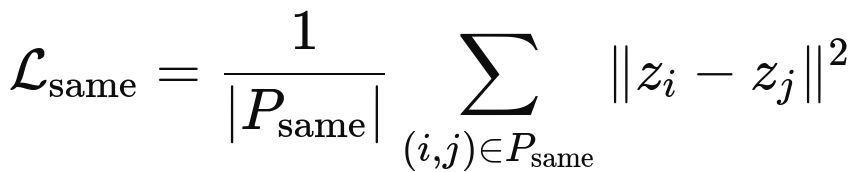
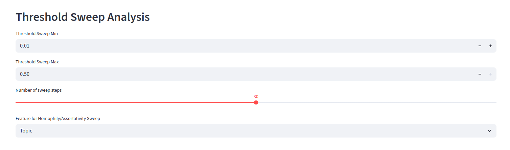

# Context-Aware Graph Structure Learning (ContextGSL)

This repository is an extension of SUBLIME for unsupervised learning of extremist narratives in social media, with **context-aware regularization** to leverage narrative features and domain knowledge for more interpretable graph embeddings.


## Table of Contents

- [Project Overview](#project-overview)
- [Datasets](#datasets)
- [Losses](#losses)
- [Experiments](#experiments)
- [Quick Start](#quick-start)
- [Visualizing Embeddings](#visualizing-embeddings)
- [Visualizing Clusters with Top Words](#visualizing-clusters-with-top-words)
- [Postprocessing and Analysis](#postprocessing-and-analysis)
- [Embeddings & Graph Visualization Dashboard](#embeddings--graph-visualization-dashboard)
- [Usage](#usage)
- [Contribution & Customization](#contribution--customization)
- [Acknowledgements](#acknowledgements)

---

## Project Overview

This project builds upon the **SUBLIME** GSL framework with custom datasets to perform tweet analysis focused on extremism and narrative features, and introduces **context-aware regularization** for improved clustering and interpretability.

---

## Datasets

Below are the main datasets used in this project, with both their description and the corresponding **class names** to use in the code (see `preprocessing.py`):

1. **ARENAS SCHEMA A1**
   - **Description:** Contains 298 tweets annotated for extremism and narrative features.
   - **Filename:** `2024_08_SCHEMA_A1.xlsx`
   - **Code reference:** `SchemaA1Dataset`

2. **Full_french_tweet_data**
   - **Description:** Contains around 40,000 tweets with various information about the tweet and some about the user who posted it.
   - **Filename:** `All_french_tweet_data.csv`
   - **Code reference:** `FullFrenchTweetDataset`

3. **ARENAS French Annotator 1**
   - **Description:** 1000 French tweets annotated by the first annotator for extremism and narrative features.
   - **Filename:** `ARENAS_DATA_FRENCH_1st_Annotator.xlsx`
   - **Code reference:** `ARENASFrenchAnnotator1Dataset`

4. **ARENAS French Annotator 2**
   - **Description:** 1000 French tweets annotated by the second annotator for extremism and narrative features.
   - **Filename:** `ARENAS_DATA_FRENCH_2ND_Annotator.xlsx`
   - **Code reference:** `ARENASFrenchAnnotator2Dataset`

5. **Toxigen**
   - **Description:** Contains English-language data for toxicity and stereotype analysis.
   - **Filename:** `Toxigen.csv`
   - **Code reference:** `ToxigenDataset`

6. **FRENK LGBTEn**
   - **Description:** English-language dataset focusing on LGBT-related posts and annotations.
   - **Filename:** `LGBTEn.csv`
   - **Code reference:** `LGBTEnDataset`

7. **FRENK MigrantsEn**
   - **Description:** English-language dataset focusing on migrant-related posts and annotations.
   - **Filename:** `MigrantsEn.csv`
   - **Code reference:** `MigrantsEnDataset`


---
## Losses

## 1. Contrastive Loss 

**Purpose:**  
To make sure the representation (embedding) of the same node under two different graph views is very similar, and the representations of different nodes are clearly distinct.

**How does it work, step by step?**

1. **For each node,** we create two "views" (versions with small random changes).
2. **We measure similarity** between the same node under different views using cosine similarity, which tells us how close or aligned two vectors are (1 means identical, -1 means opposite).
3. **We want this similarity to be as high as possible for the same node.**
4. **But for other nodes,** we want the similarity to be low.

   
## 📐 Equation


Where $\text{sim}(\cdot, \cdot)$ is cosine similarity and $\tau$ is the temperature parameter.


# 2. Context Regularization Loss 

### **Purpose**  
The **context regularization loss** encourages nodes with the same context (e.g., topic, group, or category) to have similar embeddings.  
At the same time, nodes from different contexts should be separated, but not unnecessarily far apart.

---


### How it works 

1. Compute all unique unordered pairs of nodes.
2. For **same-context** pairs:
   - Measure the distance between embeddings.
   - Add the average of these distances to the loss (we minimize this).
3. For **different-context** pairs:
   - Measure the distance between embeddings.
   - If the distance is less than a margin, add `margin - distance` to the loss (otherwise add 0).
4. The final context regularization loss is the sum of the same-context and different-context terms.

---


### **Distance Metric (Configurable)**  
- **Default:** Euclidean distance (L2 norm)  
- **Optional:** Cosine distance  
  - Enable with:  
    ```bash
    --context_distance_metric cosine
    ```

---

## 📐 Equations

### - **Euclidean Distance**

**Same-context pairs:**



**Different-context pairs:**


### - **Cosine Distance**

**Same-context pairs:**


**Different-context pairs:**


**Why do we use max(0, margin - distance)?**  
This ensures we only penalize pairs that are too close. If they’re already far apart, there’s no need to push them further.

**How do we combine these?**

- **Total context regularization loss:**


## 3. Total Loss (Training Objective)

**How do we train the model?**

- We add together the contrastive loss and the context regularization loss.
- We use a parameter called `lambda` to control how much the context regularization influences the training.

**Final equation:**


**What does this mean practically?**
- If `lambda` is high, the model pays more attention to context.
- If `lambda` is low, the model focuses more on the original contrastive objective.


---

## Summary

| Loss Component           | What it does                                      | Why we do it                |
|--------------------------|---------------------------------------------------|-----------------------------|
| Contrastive Loss         | Same node close, different nodes apart            | Robustness, discrimination  |
| Context Regularization   | Same context close, different context not too close| Semantic grouping           |
| Margin                   | Only penalize when different-context nodes are too close | Prevents over-separation    |
| Lambda                   | Controls context regularization's influence       | Tuning flexibility          |

---


---

## Experiments

Below are the main experiments with updated dataset mapping, experiment numbers, and descriptions as per the latest code organization.


1. **Experiment 1 — ARENAS SCHEMA A1 (All Entries)**
   - **Description:** First try of SUBLIME. Uses all entries from Schema A1 (`2024_08_SCHEMA_A1.xlsx`) with the `french-document-embedding` model. No filtering is applied.
   - **Configuration:** Set `exp_nb` argument to `1`; typically recommended `epoch` is `1000`.
   - **Execution:**  
     ```bash
     python src/main.py -exp_nb 1
     ```

2. **Experiment 2 — ARENAS SCHEMA A1 (Filtered Extremist Narratives)**
   - **Description:** Uses Schema A1 with the `french-document-embedding` model, filtering out nodes without both IN GROUP and OUT GROUP (i.e., only extremist narratives are kept).
   - **Configuration:** Set `exp_nb` argument to `2`; typically recommended `epoch` is `1000`.
   - **Execution:**  
     ```bash
     python src/main.py -exp_nb 2
     ```

3. **Experiment 3 — Full French Tweet Data**
   - **Description:** Uses the large French tweets dataset (`All_french_tweet_data.csv`) with the `french-document-embedding` model. This is a general (not specifically extremist) dataset, with similar processing logic.
   - **Configuration:** Set `exp_nb` argument to `3`; typically recommended `epoch` is `1000`.
   - **Execution:**  
     ```bash
     python src/main.py -exp_nb 3
     ```

4. **Experiment 4 — ARENAS French Annotator 1**
   - **Description:** Uses the first annotator's French dataset (`ARENAS_DATA_FRENCH_1st_Annotator.xlsx`) with the `french-document-embedding` model.
   - **Configuration:** Set `exp_nb` argument to `4`; `epoch` typically `1000`.
   - **Execution:**  
     ```bash
     python src/main.py -exp_nb 4
     ```

5. **Experiment 5 — ARENAS French Annotator 2**
   - **Description:** Uses the second annotator's French dataset (`ARENAS_DATA_FRENCH_2ND_Annotator.xlsx`) with the `french-document-embedding` model.
   - **Configuration:** Set `exp_nb` argument to `5`; `epoch` typically `1000`.
   - **Execution:**  
     ```bash
     python src/main.py -exp_nb 5
     ```

6. **Experiment 6 — Toxigen (English)**
   - **Description:** Uses the English `Toxigen.csv` dataset for toxicity and stereotype graph analysis.
   - **Configuration:** Set `exp_nb` argument to `6`; typically recommended `epoch` is `1000`.
   - **Execution:**  
     ```bash
     python src/main.py -exp_nb 6
     ```

7. **Experiment 7 — FRENK LGBTEn**
   - **Description:** Uses the English LGBT dataset (`LGBTEn.csv`).
   - **Configuration:** Set `exp_nb` argument to `7`; typically recommended `epoch` is `1000`.
   - **Execution:**  
     ```bash
     python src/main.py -exp_nb 7
     ```

8. **Experiment 8 — FRENK MigrantsEn**
   - **Description:** Uses the English Migrants dataset (`MigrantsEn.csv`).
   - **Configuration:** Set `exp_nb` argument to `8`; typically recommended `epoch` is `1000`.
   - **Execution:**  
     ```bash
     python src/main.py -exp_nb 8
     ```

---

> **Note:**  
> - The `exp_nb` argument in the command selects the dataset and experiment logic as described above.
> - Adjust `epoch` or other arguments as needed for your experiments in `experiment_params.csv`.
> - See the **Datasets** section for more details on each dataset and their corresponding class name in the code.

## Quick Start 

1. **Clone the Repository:**
   ```bash
   git clone https://github.com/ARENAS-Project-EU/Graph_Structure_Learning.git
   cd Graph_Structure_Learning
   ```

2. **Installation**
   Set Up Virtual Environment:
   ```bash
   python3 -m venv .venv
   source .venv/bin/activate # On Windows use `.venv\Scripts\activate`
   ```
   Install Dependencies:
   ```bash
   pip install -r requirements.txt
   ```
   > Note: The dgl (Deep Graph Library) install is for CPU, not GPU, so you may encounter errors.

3. **Run the Experiment Script**
   Update the configuration in `experiment_params.csv` and run:
   ```bash
   python src/main.py -exp_nb 1
   ```
   Replace 1 with the correct experiment number.
   After running this, you should have the tweet embeddings in `embeddings`, the resulting matrices in `adjacency_matrices`, and a plot of the loss in `plots`.


4. **To run with context regularization and specific context columns, use:**

```bash
python src/main.py -exp_nb <N> --context_mode --context_columns <COLUMN_1> <COLUMN_2> ...
```
- `-exp_nb <N>`: Selects the experiment/dataset (see experiment numbers above).
- `--context_mode`: Activates context regularization.
- `--context_columns ...`: Uses the specified column(s) for context-aware learning.

---


## Hardware & Reproducibility
- `--gpu` int (default: `0`): GPU index to use. If no GPU is available, the run will fall back to CPU.
- `--ntrials` int: Number of repeated experiments for reproducibility across multiple runs.

## Context Regularization
- `--context_mode` bool: Enable contextual regularization alongside the main objective.
- `--context_only` bool: Use only the context loss (disable contrastive loss).
- `--use_context_adj` bool: Build the graph adjacency from context features instead of text embeddings.
- `--context_columns` str: Comma-separated list of columns to use for context adjacency (e.g., `"Topic,In-Group,Out-group"`).
- `--context_distance_metric` str: Distance metric for context adjacency. Options: `euclidean`, `cosine`.
- `--context_regularization_margin` float: Margin used by the context loss.
- `--context_regularization_weight` float: Weight (lambda) for the context loss term.
- `--context_pair_samples` int: Number of sample pairs to draw per step/epoch for context loss.

## Contrastive Learning (GCL)
- `--temperature` float: Temperature parameter for contrastive loss.
- `--maskfeat_rate_anchor` float: Feature masking rate for the anchor view.
- `--maskfeat_rate_learner` float: Feature masking rate for the learner view.
- `--nlayers` int: Number of GCL encoder layers.
- `--hidden_dim` int: Hidden dimension size in the encoder.
- `--rep_dim` int: Final representation (embedding) dimension.
- `--proj_dim` int: Projector head dimension after the encoder.
- `--dropout` float: Dropout rate inside the encoder/projector.
- `--dropedge_rate` float: Edge dropout rate for graph augmentation.

## Graph Learner & Adjacency
- `--sparse` bool: Use sparse adjacency operations.
- `--type_learner` str: Graph learner type. Options: `fgp`, `mlp`, `att`, `gnn`.
- `--k` int: Number of neighbors for k-NN when building adjacency.
- `--sim_function` str: Similarity function. Options: `cosine`, `dot`.
- `--activation_learner` str: Activation used in the graph learner (e.g., `relu`).
- `--gsl_mode` str: Graph structure mode. Options: `structure_refinement`, `structure_inference`.
- `--n_neighbors` int: Number of neighbors to keep in the final adjacency.
- `--sym` bool: Symmetrize the adjacency matrix.

## Training & Optimization
- `--epochs` int: Number of training epochs.
- `--lr` float: Learning rate.
- `--w_decay` float: Weight decay (L2 regularization).

---


### **Context Columns Per Dataset**

#### **ARENAS SCHEMA A1 / Annotator 1 / Annotator 2**
You can choose **any** of the following columns as context:
- Topic
- In-Group
- Out-Group
- Initiating Problem
- Intolerance
- Superiority of in-group
- Hostility to out-group (e.g. verbal attacks, belittlement, instillment of fear, incitement to violence)
- Polarization/Othering
- Perceived Threat
- Setting
- Emotional response
- Solution
- Appeal to Authority
- Appeal to Reason
- Appeal to Probability
- Conspiracy Theories
- Irony/Humor

**Examples:**
```bash
python src/main.py -exp_nb 2 --context_mode --context_columns Intolerance Irony/Humor Polarization/Othering
python src/main.py -exp_nb 2 --context_mode --context_columns Emotional response
```

---

#### **Toxigen**
You can choose any of these columns as context:
- target_group
- factual?
- ingroup_effect
- lewd
- framing
- predicted_group
- stereotyping
- intent
- toxicity_ai
- toxicity_human
- predicted_author
- actual_method

**Example:**
```bash
python src/main.py -exp_nb 6 --context_mode --context_columns target_group intent toxicity_ai
```

---

#### **FRENK (LGBTEn / MigrantsEn)**
You can choose any of these columns as context:
- title
- url
- source
- timestamp
- text
- user_name
- user_id
- comment_url
- comment_timestamp
- annotation_type
- annotation_target
- annotation_annotator

**Example:**
```bash
python src/main.py -exp_nb 7 --context_mode --context_columns annotation_type annotation_target
```

---

> **Note:** For each dataset, only columns present in that dataset can be used as context columns.  
> Use `--context_columns` followed by one or more column names (separated by spaces).


## Visualizing Embeddings

You can visualize the learned embeddings using the provided script `visualize_embeddings.py`.  
This script takes your embeddings file and creates a 2D visualization using t-SNE or PCA.

### **Usage**

```bash
python visualize_embeddings.py --embeddings_file <path_to_embeddings.npy>
```

#### **Arguments:**

- `--embeddings_file` : Path to your embeddings file (required, e.g. `.npy` or `.pt`)
- `--output` : Path to save the visualization (optional, default: `embedding_vis.png`)
- `--method` : Dimensionality reduction method (`tsne` or `pca`, optional, default: `tsne`)

#### **Examples**

**Visualize embeddings with default settings:**
```bash
python visualize_embeddings.py --embeddings_file ./embeddings/2024_08_SCHEMA_A1_embeddings_exp2_Topic_In-Group_Initiating_Problem.npy
```

**Visualize using PCA and save to a custom file:**
```bash
python visualize_embeddings.py --embeddings_file ./embeddings/2024_08_SCHEMA_A1_embeddings_exp2_Topic_In-Group_Initiating_Problem.npy --method pca --output ./embeddings_visualization/2024_08_SCHEMA_A1_embeddings_exp2_Topic_In-Group_Initiating_Problem.png


The visualization will be saved as a PNG image and shown on your screen.

```
## Visualizing Clusters with Top Words

You can also visualize clusters and inspect the most frequent words for each cluster using the same script.  
This is especially useful for understanding the semantic structure of your embeddings and for exploring topic distributions.

#### **Additional Arguments for Cluster Visualization:**

- `--get_cluster_words` : If set, clusters the embeddings and displays the top words for each cluster (shown on the plot).
- `--num_clusters` : Number of clusters to form (default: `5`)
- `--num_words` : Number of top words to display per cluster (default: `10`)
- `--dataset` : The dataset name (e.g., `SchemaA1` or `FullFrenchTweet`) to fetch node texts corresponding to embeddings.
- `--experiment_nb` : Experiment number used to load the correct dataset split.
- `--stopwords_lang` : Stopwords language for filtering frequent words (e.g., `english`, `french`). Uses NLTK's stopwords.
- `--use_custom_french_stopwords` : If set (with French), uses a collaborative custom French stopword list in addition to NLTK's.
- `--save_cluster_words` : If set, saves the cluster top words to a text file.
- `--cluster_words_file` : Output file for the top words (default: `cluster_top_words.txt`)

#### **Example: Visualize clusters and display top words (French)**

```bash
python visualize_embeddings.py --embeddings_file ./embeddings/2024_08_SCHEMA_A1_embeddings_exp2_Topic_In-Group_Initiating_Problem.npy \
  --get_cluster_words \
  --dataset SchemaA1 \
  --experiment_nb 1 \
  --num_clusters 5 \
  --num_words 10 \
  --stopwords_lang french \
  --use_custom_french_stopwords \
  --output ./embeddings_visualization/2024_08_SCHEMA_A1_embeddings_exp2_Topic_In-group_Initiating_Problem_tsne.png \
  --save_cluster_words \
  --cluster_words_file ./embeddings_visualization/2024_08_SCHEMA_A1_embeddings_exp2_Topic_In-group_Initiating_Problem.txt
```

This will:
- Color each cluster differently in the plot.
- Display the top words for each cluster at its centroid, filtering out stopwords (from NLTK and custom list if French).
- Save the cluster top words to the specified file.

#### **Output**

- A visually enhanced plot with colored clusters and word labels.
- A text file listing the top words for each cluster.

---

#### **Tips:**

- For French or other non-English datasets, use `--stopwords_lang french` and optionally `--use_custom_french_stopwords` for more accurate filtering.
- You can adjust `--num_clusters` and `--num_words` for more or fewer clusters and words.
- The script will automatically download NLTK stopwords if not present.


## Postprocessing and Analysis
   Choose the dataset to study by changing the experiment_nb and Dataset class at the beginning of the main method.
   Make sure to use the right adjacency file for the experiment chosen.
   
---

### Basic example

```sh
python graph_eval.py --adjacency path/to/adjacency.pkl --dataset SchemaA1 --experiment_nb 2
```

### Full analysis (with connected components, communities, homophily, group ratios):

```sh
python graph_eval.py \
    --adjacency path/to/adjacency.pkl \
    --dataset SchemaA1 \
    --experiment_nb 2 \
    --connected_components \
    --communities 5 \
    --group_ratios \
    --homophily_all \
    --threshold 0.05
```

- `--adjacency`: Path to your adjacency matrix pickle file
- `--dataset`: Which dataset class to use (`SchemaA1`, `FullFrenchTweet`, `Selected`, `OldSchemaA1`)
- `--experiment_nb`: (int) experiment index for the dataset
- `--threshold`: Similarity threshold for graph edges (default 0.05)
- `--connected_components`: Save PNG visualization and interpretation of graph clusters
- `--communities [N]`: Detect N communities (Girvan-Newman), save PNG and interpretation
- `--group_ratios`: Include summary of group ratios in clusters (only in summary file, no CSV)
- `--homophily [COLUMN]`: Analyze homophily for a single feature
- `--homophily_all`: Analyze homophily for all key features (see script for feature list)


# Embeddings & Graph Visualization Dashboard

This Streamlit dashboard provides an **interactive, interpretable, and visually appealing environment** for exploring graph embeddings, community detection, and feature statistics in social network datasets (e.g., extremist narratives, online communities).


---

## Features

### 1. **Embedding Visualization**
- **Upload embeddings** (`.npy` or `.pt`) and apply dimensionality reduction (**t-SNE** or **PCA**).
- **Cluster embeddings** using KMeans with custom cluster count.
- **Visualize clusters** in 2D, with each cluster color-coded.
- **Top words per cluster** are displayed both on the plot and in a sidebar for quick insight into cluster semantics.


---

### 2. **Graph Visualization**
- **Upload adjacency matrix** (`.pkl`) to construct the network graph.
- **Node metadata** (from chosen dataset and experiment) enriches the graph for rich analysis.
- **Threshold slider** lets you filter out weak edges, revealing core structure.

#### **Community Detection**
- Detect communities using the **Girvan-Newman algorithm**.
- Visualize community structure interactively:
  - **Nodes labeled by index** (e.g., 0, 1, 2, ...)
  - **Color-coded by community**
  - **Hover for info:** Cluster number, node index, selected feature, and node text.


---


#### **Feature Selection & Interactive Inspection**
- Choose any feature column (e.g., topic, in-group, gender) for:
  - **Hover info on nodes**

- **Top-k words per community**: For each detected community, the dashboard computes and displays the most frequent words found in the texts of the community's nodes.
  - This helps you quickly understand the main themes or subjects discussed within each group.


#### **Inspect Node Details**
- Select any node to see all metadata and the original text for deep qualitative inspection.


#### **Cluster Statistics**
- Select any detected community (cluster) to view:
  - **Distribution of all categorical features**
  - **Percentage breakdowns** visualized as bar charts
  - Instantly compare feature prevalence across clusters


---

### **Additional Graph Insights**
- **Assortativity** and **homophily** metrics for any feature, to measure echo chambers and group isolation.


- **Connected component sizes** and basic graph statistics (density, edge count, etc.).


- **Threshold Sweep Analysis :**  
  The dashboard includes **interactive sweep plots** to analyze how network properties change as you vary the edge threshold:
  
  - **Homophily vs. Threshold:** Shows how edge similarity changes with threshold.
  

  - **Number of Edges vs. Threshold:** Visualizes graph sparsity.
  
  - **Number of Connected Components vs. Threshold:** Reveals when the network breaks up.
  
  - **Assortativity vs. Threshold:** Measures how attribute-based mixing varies.
  

  > **Note:** The threshold controls and sweep plots allow values up to `0.5`, so you can explore sparsification effects across a broad range.


---

## Usage

1. **Upload your data:**
   - Embeddings (`.npy`, `.pt`): For embedding visualization and clustering.
   - Adjacency matrix (`.pkl`): For graph/network analysis.
2. **Interactively explore:**
   - Use sliders and dropdowns to refine clustering, thresholding, feature selection, and analysis.
   - Click through tabs for embeddings, graph, and cluster statistics.
3. **Analyze communities:**
   - Detect clusters.
   - Visualize feature distributions.
   - Inspect individual nodes.

---


## How to Run

1. Make sure you have the required dependencies:
   ```bash
   pip install -r requirements.txt
   ```
2. Place your embeddings and adjacency matrices in the expected format.
3. Run:
   ```
   streamlit run dashboard.py
   ```
4. Enjoy exploring your data!

---

## Contribution & Customization

The dashboard is modular and easy to adapt to new datasets and feature types.  
Feel free to improve the visuals, add new algorithms, or connect to other sources!


#### **Troubleshooting**

If you see common or irrelevant words in your cluster top words, consider adding them to the custom stopword list in the script for better filtering.


## Acknowledgements

This work was conducted as part of the European [Arenas](https://arenasproject.eu/) project, funded by Horizon Europe.
Its objective is to characterize, measure, and understand the role of extremist narratives in discourses that have an impact not only on political and social spheres but importantly on the stakeholders themselves.  Leading an innovative and ambitious research program, ARENAS will significantly contribute to filling the gap in contemporary research, make recommendations to policymakers, media, lawyers, social inclusion professionals, and educational institutions, and propose solutions for countering extreme narratives for developing more inclusive and respectful European societies.
